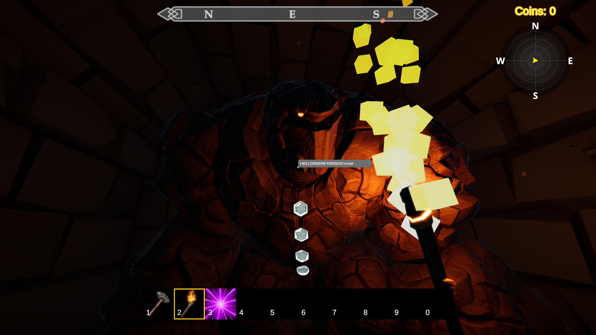

## See it in action



---

## What's new

- **3 basic zones** - entry hall gets player use to the cart and grab mechanics

- **Portals** - you can now take a portal to the village where you can sell your items

- **Village** - The first vendor has been added with vendor upgrades. When you sell enough loot, new tools appear to purchase

- **Tools** 
    - Hammer: used to smash things! (just crates atm)
    - Blazing Torch: used to light the way, light torches, and melt ice
    - Loot Magnet: Creates a vortex to suck up all nearby loot... and launch it!

- **Loot Golem** - Got too many low-tier items? Loot Golem is your friend: he'll eat all your delicious common shields and spit out a disgusting rare.

- **Air Lifts** - I needed more "physics fun" in the game, so I've added in air lifts - will add more stuff like this in future

- **Glowing Item Chests** - Get some random loot. Also gives you a magical item shrinker to carry more stuff!

---

How's it looking?

Drop your thoughts in the  or reply on socials. Every bit of feedback is going directly into the next sprint.
